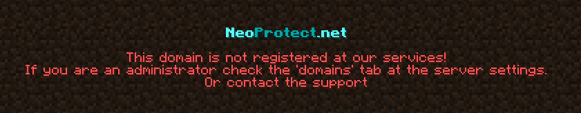

# 'Invalid hostname' error

## The actual error

If you see errors like

or

you are in the right place!

## Checklist

### 1. Check the domain you join with

In this example we say that we want to join to our server using `play.example.com`.
I set up a CNAME record on `play.example.com` correctly, the problem is that i forgot to add
it to our domains tab in our panel. 

### 2. I did not add both SRV and CNAME domains to our panel

If you have a SRV record pointing to another CNAME e.g. `_minecraft._tcp.example.com` (SRV)
pointing to `play.example.com` (CNAME) you need to register both `play.example.com` and `example.com`
in our panel.